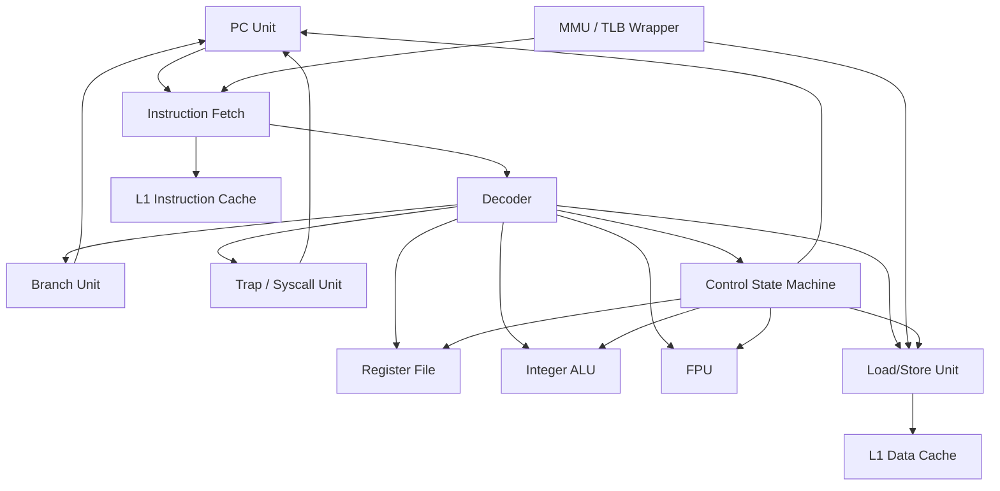
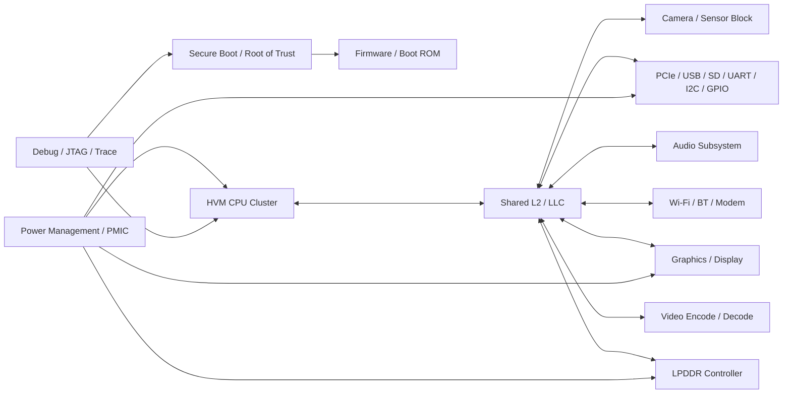

# HVM Block Diagrams

Version: `1.0`

This document provides simple block diagrams for the HVM microprocessor and the consumer SoC that surrounds it.

## 1. Microprocessor Block Diagram

### Notes

- The processor is intentionally load/store based.
- Branch and call control flow is explicit.
- The MMU wrapper is optional for the first RTL revision, but the interface should be planned early.
- Caches can be added around the same core without changing the ISA contract.

## 2. Consumer SoC Block Diagram

### Notes

- The SoC is organized around a shared interconnect and a coherent memory hierarchy.
- Laptop and mobile variants share the same core compute design.
- Peripheral blocks scale by product tier rather than by ISA changes.

## 3. Design Principle Summary

- Keep the core small.
- Keep the interconnect simple.
- Keep the firmware path explicit.
- Keep the ISA stable while scaling product features around it.

