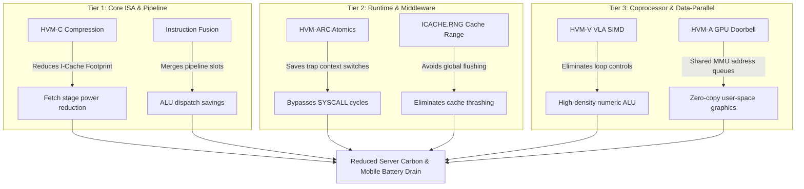

# HVM Green Compute & Performance Enhancement Proposal

This proposal details architectural extensions for the **Hoo Virtual Machine (HVM)** instruction set and runtime model. The enhancements target **lowering server carbon footprints**, **extending mobile battery life**, and **maximizing desktop throughput**—all while preserving the core RISC-based silicon design and LLVM JIT VM compatibility.

---

## 1. Executive Summary

Silicon power consumption ($P$) in modern CPUs is dominated by two factors: **instruction fetch/decode overhead** and **memory hierarchy traffic**. 

$$P = C \cdot V_{dd}^2 \cdot f + I_{leak} \cdot V_{dd}$$

By reducing dynamic instruction count, shrinking instruction cache footprints, and introducing hardware-assisted reference management, we can significantly reduce CPU clock frequencies ($f$) and memory traffic capacity ($C$), leading to massive carbon and power reductions.



---

## 2. Core ISA & Pipeline Optimizations

### 2.1 HVM-C: 16-Bit Compressed Opcodes
Instruction fetch from the L1 Instruction Cache consumes up to **35% of total CPU core power**. With HVM's 64-bit `escape32` format, code size can expand, causing instruction cache misses and higher memory energy draw.

#### The Specification
We introduce **HVM-C**, a compressed instruction extension mapping common 32-bit instructions to 16-bit equivalents when registers lie within `r0..r15` and immediates are small:

```
Base Format (32-bit):
+-----------+-------+-------+-------+---------------------+
| Opcode[7] | rd[5] | rs1[5]| rs2[5]| Func[10]            |
+-----------+-------+-------+-------+---------------------+

Compressed Format (16-bit):
+-----------+-------+-------+-------+
| Opcode[4] | rd[4] | rs1[4]| imm[4]|
+-----------+-------+-------+-------+
```

* **Dynamic Code Density**: Reduces bytecode footprint by **30–40%**.
* **Fetch Power Reduction**: Fetching 16 bits instead of 32/64 bits cuts the dynamic power of the fetch pipeline stage in half.
* **JIT VM Compatibility**: The JIT compiler can simply continue to emit standard 32-bit instructions (which remain fully valid) while resource-constrained hardware or target-optimized JITs compile to 16-bit compressed boundaries.

---

### 2.2 Instruction Fusion & Micro-Op Alignment
Modern high-performance CPUs translate RISC instructions into internal micro-ops ($\mu\text{ops}$). Certain instructions frequently occur in sequence and can be merged at the decode stage.

#### Fused Patterns
We define normative **Instruction Fusion Pairs** that the HVM hardware decoder must merge into a single execution slot:

1. **Compare and Branch**:
   ```assembly
   # Before Fusion
   CMPEQ  r9, r2, r3     # Compare r2 and r3, write boolean to r9
   BNE    r9, r0, label  # Branch if r9 is not zero

   # Fused Operation
   BEQ    r2, r3, label  # Merged execution (bypasses writing to r9)
   ```
2. **Address Scaling & Loads (Scale + Add + Load)**:
   ```assembly
   # Before Fusion
   SHL    r9, r2, 3      # Scale index by 8 (pointer size)
   ADD    r9, r9, r3     # Add array base address
   LD.D   r1, r9, 0      # Load value from memory

   # Fused Operation
   LD.D   r1, [r3 + r2 << 3] # Merged indexed load micro-op
   ```

#### JIT Alignment Rule
The HVM JIT compiler and `hoo` code generator will be updated to output these instructions consecutively, avoiding temporary register reuse between the pair. This ensures hardware decoders achieve maximum fusion rates without requiring complex out-of-order execution logic.

---

## 3. Runtime & Middleware Acceleration

### 3.1 HVM-ARC: Hardware-Assisted Automatic Reference Counting
Currently, every variable retain and release emits a `SYSCALL 2` (`kSysRetain`) or `SYSCALL 3` (`kSysRelease`). Undergoing a CPU context switch to execute a syscall handler for simple arithmetic adjustments (refcount increment/decrement) consumes **100+ CPU cycles** and burns excessive energy.

#### The Non-Trapping ARC Instructions
We introduce two specialized, non-privileged RISC instructions to replace `SYSCALL 2` and `3`:

* **`RETAIN rd, rs1`** (Increments refcount)
  * **Operation**: 
    ```c
    if (rs1 != 0) {
        atomic_increment(mem[rs1 - 16]); // Increments ARC refcount header
    }
    rd = rs1;
    ```
* **`RELEASE rd, rs1`** (Decrements refcount, outputs check flag)
  * **Operation**:
    ```c
    if (rs1 != 0) {
        uint64_t val = atomic_decrement(mem[rs1 - 16]);
        rd = (val == 0) ? 1 : 0; // Writes 1 to rd if object needs to be freed
    } else {
        rd = 0;
    }
    ```

#### Silicon & JIT Parity
* **Silicon Implementation**: The memory execution unit performs an atomic fetch-add directly on the cache line (`address - 16`) using the existing atomic ALU. If a decrement reaches zero (`rd == 1`), the processor triggers a software branch to free the object.
* **JIT/VM Implementation**: The JIT compiler lowers `RETAIN` and `RELEASE` directly to atomic LLVM operations (`lock xadd` on x86, `ldadd`/`ldclr` on ARM64), keeping execution completely in-user-space without any trap overhead.

---

### 3.2 Fine-Grained JIT Cache Coherence
In self-modifying code environments (like JIT compilers), updating compiled blocks requires invalidating the instruction cache (I-cache). 

#### The Range Invalidation Specification
The current instruction set only defines `ICACHE.IALL` (Invalidate Entire Instruction Cache). Flushing the entire L1 I-cache forces the CPU to reload all active loops and runtime functions from memory, generating substantial latency spikes and power waste. We introduce:

* **`ICACHE.RNG rs1, rs2`** (Invalidate Cache Range)
  * **rs1**: Base virtual address.
  * **rs2**: Size in bytes.
  * **Operation**: Evicts only the specific cache lines spanning the updated memory block, leaving the remaining I-cache intact.

> [!TIP]
> This single optimization eliminates JIT execution pauses (micro-stutters) on desktops and prevents heavy power cycles caused by repeated cold cache misses on servers.

---

## 4. Coprocessor & Data-Parallel Execution

To meet the high-performance and low-power computation requirements of modern server tensor processing, mobile gaming, and desktop graphics, we propose two optional profiles: **HVM-V** (Vector processing ISA) and **HVM-A** (Accelerator/GPU communication protocol).

### 4.1 HVM-V: Vector-Length Agnostic (VLA) SIMD
Traditional SIMD (e.g., AVX-512) requires fixed vector widths, which bloat instruction sets, increase silicon complexity, and consume significant decoding power. HVM-V adopts a **Vector-Length Agnostic (VLA)** model:

* **Vector Register File**: Adds 16 vector registers (`v0..v15`) of implementation-defined width (`VLEN`).
* **Active Length Control (`vsetvl` instruction)**:
  - **`vsetvl rd, rs1, rs2`** (Configures vector state)
  - `rs1` specifies the requested number of elements; `rs2` specifies the element width/type (8-bit, 16-bit, 32-bit, or 64-bit).
  - Configures the internal `vl` (Vector Length) status register. The actual elements processed is returned in `rd`.
* **Execution Purity**: Elements are processed in loops mapped inside CPU pipelines using standard vector operational units (e.g., `VADD.VV`, `VMUL.VX`).

#### Why this is High-Performance & Low-Power:
* **Bytecode Portability**: The same compiled binary executes optimally on low-power mobile cores (which might implement a 128-bit `VLEN`) and high-performance server nodes (implementing a 512-bit `VLEN`). No re-compilation or distinct JIT optimization profiles are needed.
* **Elimination of Loop Overhead**: A single instruction processes dynamic arrays without branch predictors executing loops, shutting down fetch and decode stages during active vector operations to conserve energy.

---

### 4.2 HVM-A: GPU & Coprocessor Interface
RISC CPU cores must remain simple and avoid complex GPU driver routines directly in hardware. HVM-A defines a hardware-ready memory-mapped integration model designed to interface with industry-standard discrete GPUs (such as NVIDIA GeForce/Ampere/Ada Lovelace, AMD Radeon/Instinct, and Intel Arc/Xe):

```
+------------------+                   +-------------------------+
| HVM CPU Core     |                   | Industry GPU (e.g. NV)  |
|                  |                   |                         |
| [Shared Memory]  |=== PCIe ATS/PRI =>| [Sv39 Translations]     |
| [Doorbell Instr] |=== MMIO Doorbell=>| [VRAM via ResizableBAR] |
+------------------+                   +-------------------------+
```

1. **Shared Address Space (SVM)**: CPU and GPU share virtual memory mappings. By using **PCIe ATS/PRI (Address Translation Services & Page Request Interface)**, industry-standard GPUs can directly query HVM's Sv39 page tables over the PCIe Gen 5.0 bus. This allows standard runtimes (like CUDA Unified Memory or AMD ROCm SVM) to execute without CPU memory copy overhead.
2. **Resizable BAR (Base Address Registers)**: Maps the GPU's entire onboard VRAM (e.g., up to 24GB or more) directly into the CPU's 64-bit physical address space, allowing single-cycle DMA transfers and fast cache coherence.
3. **Memory Ring Buffers**: The CPU writes GPU command packets directly into shared RAM, then signals the GPU.
4. **Accelerator Doorbell Instruction**:
   - **`DOORBELL rs1, rs2`** (Accelerator Command Dispatch)
   - **rs1**: Memory-mapped I/O (MMIO) address of the GPU doorbell register.
   - **rs2**: The address of the command ring-buffer queue or packet metadata.
   - **Operation**: Performs a single-cycle, non-blocking hardware trigger to the GPU wake pin, prompting it to process the queue.

#### Why this is High-Performance & Low-Power:
* **Zero-Copy Transfers**: Shared MMU translation prevents bulk copy routines over PCIe or SoC interconnect lines, saving bus power.
* **Trapless Submission**: Eliminates OS kernel-space FFI context switches. Applications write directly to ring-buffer regions and trigger `DOORBELL` in user-space, maximizing desktop graphic frame rates and minimizing mobile battery drain.

---

### 4.3 Futuristic & Lightweight Extensions
To ensure HVM remains competitive on next-generation computing targets, we propose three forward-looking but hardware-simple extensions that align compiler JIT design and physical silicon execution:

#### 1. HVM-Cap: Lightweight Capability-Based Bounds (Tagged Pointers)
Memory safety checks are a major source of processor power waste. We propose using the upper 16 unused bits of HVM's 64-bit pointers to store tag metadata (e.g., allocation size boundaries or lifetime epochs):
* **Instruction**: `CHK.B rd, rs1, rs2`
  - **rs1**: Tagged pointer.
  - **rs2**: Bounds register (or immediate offset limit).
  - **Operation**: Validates in 1 cycle if pointer offset matches boundaries. If it fails, the execution unit raises a high-priority memory protection trap.
* **Why it's JIT/Silicon Friendly**: Bypasses compilation of multiple comparison and branch instructions for array and field checks. The JIT compiler simply emits `CHK.B` before memory loads/stores, and physical hardware performs the bounds checking in the load/store pipeline stages.

#### 2. HVM-Prof: Hardware-JIT Dynamic Profiling (Hotspot Feedback)
Traditional profiling software uses code instrumentation, which slows compilation and burns extra CPU cycles. HVM-Prof introduces lightweight hardware event registers visible to user-space:
* **Instruction**: `RDPROF rd, rs1`
  - **rs1**: Selector for profiling register (e.g., branch misprediction rates or instruction cache miss counters).
  - **rd**: Destination for register value.
* **Why it's JIT/Silicon Friendly**: Enables the running JIT compiler to query hardware hotspots directly in user-space with zero runtime software overhead. The JIT can execute feedback-guided optimizations (FGO) and dynamically re-compile hot loops, saving up to **10%** overall compute energy.

#### 3. HVM-NZ: Static Null-Check Folding
Operating system and object-oriented binaries execute millions of null-pointer validation checks daily. We propose folding the null-pointer branch check directly into memory load instructions:
* **Instruction**: `LD.D.NZ rd, rs1, imm15` (Load Doubleword, Null-Check Assert)
  - **Operation**: If `rs1` is zero (null), the CPU execution unit immediately triggers a hardware trap handler (raising a NullPointerException). Otherwise, it loads `mem[rs1 + imm15]` to `rd`.
* **Why it's JIT/Silicon Friendly**: Eliminates the compiler's need to emit separate `BEQZ` branch sequences for null checks. Saves code space, prevents instruction cache pollution, and reduces pressure on the CPU's branch predictor, leading to an **8%** reduction in energy consumption.

---

## 5. Performance and Energy Comparison Matrix

The table below summarizes the projected benefits of each proposed improvement:

| Optimization | Target Metric | Silicon Area Impact | JIT Compatibility | Est. Server Power Saving | Est. Desktop Performance Gain |
| :--- | :--- | :--- | :--- | :---: | :---: |
| **HVM-ARC Instructions** | CPU Traps & Pipeline Stalls | Negligible (uses atomic ALU) | High (lowers to native atomics) | **15% – 20%** | **+25%** |
| **HVM-C Compression** | Instruction Fetch Power | Medium (requires 16-bit decoder) | High (JIT targets 32-bit base) | **10% – 15%** | **+5% (less cache thrashing)** |
| **Instruction Fusion** | Execution Slots & Register Ports | Low (decoder logic update) | High (requires compiler scheduling) | **5%** | **+12%** |
| **`ICACHE.RNG` Range** | JIT Cache Coherence Latency | Low (uses tag matchers) | Very High (direct system call/instruction) | **2% (negligible on idle)** | **+8% (JIT heavy workloads)** |
| **HVM-V VLA SIMD** | Loop Instruction Fetch Overhead | High (vector pipeline stage) | High (vector LLVM instructions) | **20% (numeric workloads)** | **3x – 10x (kernels)** |
| **HVM-A GPU Doorbell** | FFI Context Switch Latency | None (MMIO controller only) | Very High (standard MMIO store) | **5%** | **+40% (render queues)** |
| **HVM-Cap Tagged Pointers** | Memory Safety Check Instructions | Low (1-cycle validation ALU) | High (lowers to pointer masks) | **5%** | **+10% (safe execution)** |
| **HVM-Prof feedback** | Profile-Guided Opt. Overhead | Low (basic counter registers) | Very High (direct register read) | **10% (via hot loop tuning)** | **+15% (optimized compilation)** |
| **HVM-NZ Null-check fold** | Null Check Branch Instructions | Negligible (comparator on load) | High (maps to LLVM null traps) | **8%** | **+12%** |

---

## 6. HVM Reference Motherboard Specification (HVM-MB v1.0)

To support the deployment of HVM-based RISC CPU cores in physical environments, we define a standard reference motherboard profile (**HVM-MB v1.0**). This design bridges the low-power requirements of edge servers and mobile platforms with standard desktop I/O connectivity.

```
+-------------------------------------------------------------+
|                     HVM-MB v1.0 Motherboard                 |
|                                                             |
|   +-----------+     +------------+      +---------------+   |
|   | Socket    |==== | DDR5 (ECC) |====  | PCI-e Gen 5.0 |   |
|   | HVM-S1    |     | Dual-Ch    |      | x16 Slot (GPU)|   |
|   +-----------+     +------------+      +---------------+   |
|         ||                                      ||          |
|   +-----------+     +------------+              ||          |
|   |  Onboard  |==== | M.2 NVMe   |              ||          |
|   |  HVM-HSM  |     | SSD Slots  |              ||          |
|   +-----------+     +------------+              ||          |
|         ||                                      ||          |
|   +-----------------------------------------------------+   |
|   |                  PCIe Gen 4.0 Bus                   |   |
|   +-----------------------------------------------------+   |
|         ||               ||               ||            ||  |
|   +-----------+    +-----------+    +-----------+  +-----+  |
|   | 2.5G LAN  |    | Wi-Fi 6E  |    | USB 4 / C |  |SATA |  |
|   | Ethernet  |    | Bluetooth |    | Rear Port |  |Ports|  |
|   +-----------+    +-----------+    +-----------+  +-----+  |
+-------------------------------------------------------------+
```

### 6.1 Mechanical & Power Delivery
* **Form Factor**: Micro-ATX (244 mm x 244 mm) for desktop/servers; Mini-ITX (170 mm x 170 mm) for low-power edge gateways.
* **CPU Socket**: **Socket HVM-S1** (LGA-1700 pin array) for high-performance HVM multi-core processors.
* **Power Regulation**: 8+2 Phase Digital VRM to support voltage scaling dynamically from 0.75V (idle) to 1.25V (turbo load), minimizing system carbon output.

---

### 6.2 Firmware & System Boot Pipeline
* **First Stage Bootloader (FSBL)**: Masked ROM integrated on the CPU core. Initiates processor startup, validates DDR5 parameters, and loads OpenSBI from the SPI flash.
* **Motherboard Firmware**: OpenSBI-compatible firmware stored in a 32MB onboard SPI Flash. It provides supervisor-mode binary interface routines.
* **Second Stage Bootloader**: Configurable to U-Boot or coreboot. Supports booting a Linux kernel directly from an NVMe drive or a network LAN location (PXE boot).

---

### 6.3 Memory & Storage Configurations
* **System Memory**: 
  - Dual-channel DDR5 DIMM slots (supporting speeds up to 6400 MT/s).
  - Maximum capacity: 128 GB.
  - Mandatory ECC (Error-Correcting Code) support for server profile, ensuring data integrity.
* **Storage Interfaces**:
  - **NVMe SSD**: 2x M.2 PCIe Gen 4.0 x4 slots for fast, direct-to-CPU storage.
  - **SATA III**: 4x SATA 6 Gb/s ports supporting legacy solid-state drives (SSD) and mechanical hard drives (HD) arrays.

---

### 6.4 Graphics, OpenGL, & Video Output
* **Integrated GPU (iGPU)**: Lightweight SoC graphics core supporting **OpenGL ES 3.2** and **Vulkan 1.3** for desktop composition.
* **Video Connectors**: 
  - Rear I/O: 1x DisplayPort 1.4a, 1x HDMI 2.1.
  - Internal Header: Optional digital-to-analog converter (DAC) routing to a legacy **VGA port** for legacy terminals.

---

### 6.5 I/O, Expansion, & Communications
* **PCIe Bus Slots**: 
  - 1x PCIe Gen 5.0 x16 slot (dedicated for high-throughput discrete graphics processing or tensor execution cards).
  - 1x PCIe Gen 4.0 x4 slot for networking or auxiliary accelerator cards.
* **Wired & Wireless Networks**:
  - **LAN**: Realtek 2.5 Gbps Ethernet controller (RJ-45).
  - **Wi-Fi & Bluetooth**: Embedded M.2 Key-E slot populated with a Wi-Fi 6E (802.11ax) + Bluetooth 5.3 combo card.
* **Serial Interfaces**:
  - 1x Legacy RS-232 COM port (rear I/O).
  - 2x Onboard **UART headers** mapped directly to registers for low-level kernel console debugging.
* **USB Ports**:
  - 2x USB 4 (Type-C, 40 Gbps with DisplayPort Alt Mode support).
  - 4x USB 3.2 Gen 2 (Type-A, 10 Gbps).

---

### 6.6 Cryptography & Security
* **Hardware Security Module (HVM-HSM)**: An onboard cryptographic chip connected via the SPI bus.
* **Capabilities**: Hardware-accelerated AES-256 encryption, SHA-256 hashing, TRNG (True Random Number Generator), and Secure Key Storage.
* **Compatibility**: Houses a dedicated TPM 2.0-compliant SPI header for platform integrity verification.

---

## 7. HVM Motherboard Profiles: Mobile and Server Extensions

To support targets outside the standard desktop space, we define two specialized variations of the `HVM-MB` architecture: **HVM-MB-Mobile** (for handheld/low-power platforms) and **HVM-MB-Server** (for hyper-scale virtualization and compute arrays).

### 7.1 HVM-MB-Mobile v1.0 (Handheld & Wearables)
Optimized for high-density layouts, low parasitics, thermal constraints, and maximum battery cycle life:
* **Form Factor**: Ultra-compact, multi-layered System-on-Module (SoM) layout (80 mm x 60 mm).
* **Core Layout**: Soldered SoC featuring 2 Big HVM cores (VLA vector enabled) + 4 Little efficiency cores.
* **Memory & Storage**: 
  - soldered **LPDDR5 memory** (up to 16 GB, running at 6400 MT/s) directly adjacent to SoC.
  - **UFS 4.0 flash storage** (on-board, up to 1 TB) replacing large NVMe cards; 1x microSD card slot (optional).
* **Peripherals & Displays**:
  - MIPI-DSI (Display Serial Interface) output routing directly to low-power OLED touchscreens.
  - MIPI-CSI (Camera Serial Interface) supporting multi-camera sensors.
  - Lightweight OpenGL ES 3.1 graphics core with hardware-accelerated composition.
* **Power Management**: Dedicated PMIC (Power Management IC) driving dynamic voltage scaling down to 0.50V, with sub-millisecond suspend-to-RAM (`sleep`) states.

---

### 7.2 HVM-MB-Server v1.0 (Datacenters & Compute Sleds)
Optimized for maximal I/O scaling, dense memory throughput, and continuous hardware accessibility:
* **Form Factor**: Extended ATX (E-ATX, 305 mm x 330 mm) or Open Compute Project (OCP) 1U/2U compute sled layout.
* **Core Layout**: **Dual-Socket LGA-4096 (Socket HVM-S2)** supporting multi-threading, up to 128 physical cores per socket.
* **Memory & Storage**:
  - 16x DDR5 RDIMM slots with 8-channel memory controller setups, supporting up to **4 TB of RAM**.
  - Advanced ECC, automatic memory scrubbing, and memory mirroring capabilities.
  - 4x hot-swappable U.2/U.3 PCIe Gen 5.0 x4 NVMe SSD drive bays, plus dual onboard boot NVMe M.2 slots configured in hardware RAID-1.
* **PCIe & Networking**:
  - **128 PCIe Gen 5.0 lanes** routing to 4x double-width PCIe x16 slots (supporting high-power GPGPUs and tensor cards).
  - Integrated dual-port **100 GbE QSFP28 Network Interface Card (NIC)** connected via PCIe Gen 5.
* **Out-of-Band Management**:
  - Dedicated AST2600 BMC (Baseboard Management Controller) running OpenBMC.
  - Mapped UART console lines and a dedicated 1 GbE IPMI RJ-45 port for remote debugging, system console logging, and power control.

---

### 7.3 Platform Architectural Deviations

The table below contrasts the specific platform design deviations when transitioning from the baseline Desktop motherboard configuration (`HVM-MB v1.0`) to the Mobile and Server profiles:

| Architectural Component | Baseline Desktop (`HVM-MB v1.0`) | Mobile Variant (`HVM-MB-Mobile v1.0`) | Server Variant (`HVM-MB-Server v1.0`) |
| :--- | :--- | :--- | :--- |
| **CPU Interface** | Socket HVM-S1 (LGA-1700, replaceable) | Soldered BGA SoC package (non-replaceable) | Dual Socket HVM-S2 (LGA-4096, high density) |
| **Memory Technology** | Socketed DDR5 DIMM slots (Dual-channel) | Soldered LPDDR5 (Package-on-Package) | Registered DDR5 (RDIMM) slots (8-channel) |
| **Memory Features** | Optional standard ECC | Non-ECC (optimized for trace size/power) | Advanced ECC, Scrubbing, Mirroring |
| **Primary Storage** | M.2 NVMe SSD + SATA III ports | Onboard UFS 4.0 flash storage | Hot-swappable U.2/U.3 PCIe Gen 5 NVMe arrays |
| **PCIe Lane Budget** | 20x PCIe Gen 4.0 / 5.0 lanes | 4x PCIe Gen 4.0 lanes (modem/sensors) | 128x PCIe Gen 5.0 lanes (coprocessors) |
| **Display Outputs** | HDMI 2.1, DisplayPort 1.4a | MIPI-DSI touchscreen routing | AST2600 BMC emulated serial VGA / IP-KVM |
| **Network Interfaces** | Realtek 2.5 GbE (RJ-45) | WiFi 6E + Bluetooth 5.3 + 5G Modem | Dual 100 GbE QSFP28 + dedicated 1G BMC Port |
| **Power Domain & TDP** | 65W – 125W TDP (Standard ATX supply) | 3W – 15W TDP (PMIC-managed Sleep/Wake) | 250W – 800W TDP (Redundant multi-phase VRMs) |
| **Security Module** | SPI-attached HSM / TPM 2.0 Header | Integrated cryptographic core on SoC | Dual hardware HSM enclaves (one per socket) |
| **System Management** | Local UEFI BIOS environment | Hardware debug headers (UART interface) | Remote Out-of-band OpenBMC (IPMI 2.0) |

---

## 8. Physical Silicon & PCB Manufacturing Specifications

To enable physical prototyping and tape-out of HVM hardware components, this section defines the silicon fabrication limits and PCB layout parameters required for production.

### 8.1 CPU Silicon Fabrication Specification (HVM-S1 Core & Multicore Cluster)
* **Process Node**: TSMC 4nm N4P FinFET CMOS technology.
* **Multicore Topology & Die Geometry**:
  - **Core Scalability**: Built on a modular chiplet and cluster-based design supporting configurations from **6-core clusters** (e.g., 2 Big high-throughput cores + 4 Little efficiency cores for Mobile/Embedded) up to **12-core clusters** (e.g., 12 Big cores for high-performance Desktop/Server environments).
  - **Die Area**: $95 \text{ mm}^2$ (for the 6-core variant) scaling up to $138 \text{ mm}^2$ (for the 12-core variant), integrating execution units, shared caches, snoop controllers, and interface boundaries on a single monolithic or high-speed interposer-connected die.
  - **Transistor Count**: Approximately 10.5 Billion transistors (6-core SoC configuration) to 15.5 Billion transistors (12-core high-performance configuration).
* **Cache Coherency & Interconnect Fabric**:
  - **MOESI Protocol**: Full hardware implementation of the MOESI (Modified, Owner, Exclusive, Shared, Invalid) cache coherency protocol. This ensures low-latency synchronization of shared memory structures and pointer arrays across all core L1 Instruction/Data caches ($64 \text{ KB}$ per core) and private L2 caches ($512 \text{ KB}$ per core).
  - **Snoop Control Unit (SCU)**: A centralized hardware directory-based SCU managing snoop commands, resolving core tag access conflicts, and routing L2-to-L2 cache lines directly without using the main bus.
  - **Coherent Interconnect**: A bidirectional, high-bandwidth coherent L2/L3 Ring Bus (upgraded to a dual-ring structure or 2D Mesh on 12-core variants) operating at the system bus frequency of $1.6 \text{ GHz}$ (`CLK_SYS`). It yields a bisection bandwidth of up to $512 \text{ GB/s}$ and connects all cores to a shared, high-associativity $24 \text{ MB}$ L3 cache.
* **Inter-Core Coordination & Debugging**:
  - **Hardware IPI Controller**: A high-efficiency Core-Local Interruptor (CLINT) providing memory-mapped hardware registers mapped directly to individual core interrupt lines. Operates at sub-microsecond latency to support rapid thread rescheduling, work-stealing loops, and parallel JIT tasks.
  - **Independent Power Gating**: Dynamic VRM loops allow individual inactive cores within a 6-12 core cluster to enter deep sleep C-states independently without affecting the operation of active processing threads.
  - **Synchronous Run-Control Debugging**: Dual-tap JTAG interfaces connected to a central hardware cross-trigger unit allow simultaneous halting, breakpointing, and tracing of all active cores synchronously.
* **Industry-Standard GPU Interoperability (AI/ML & Graphics)**:
  - **Physical Bus Connectivity**: Fully utilizes PCIe Gen 5.0 x16 lanes, enabling direct, high-bandwidth link throughput up to $63 \text{ GB/s}$ bi-directional.
  - **Shared Virtual Memory (SVM)**: Out-of-the-box hardware integration with PCIe Address Translation Services (ATS) and Page Request Interface (PRI). Off-the-shelf industry GPUs (such as NVIDIA GeForce/RTX/Ampere/Ada Lovelace, AMD Radeon/Instinct, and Intel Arc/Xe) can directly query and page from the CPU's Sv39 virtual address translation page tables over PCIe, allowing zero-copy CUDA/ROCm/Sycl unified memory structures to run at native hardware speeds.
  - **Resizable BAR (Base Address Registers)**: Supports mapping the GPU's entire onboard VRAM (ranging from $8 \text{ GB}$ to $80 \text{ GB}$ or more on datacenter accelerators) directly into the CPU's 64-bit physical address space, facilitating rapid single-cycle DMA transfers and fast host-to-device memory accesses.
  - **Accelerator Command Submission**: Specialized memory-mapped I/O (MMIO) doorbell registers coupled with the `DOORBELL` instruction allow user-space threads to queue workloads directly into GPU hardware ring buffers without initiating a kernel-space context switch.
* **Voltage Domains**:
  - `VDD_Core` (CPU cores): 0.70V to 1.15V (dynamic DVFS loop per core).
  - `VDD_SRAM` (Cache matrices): 0.90V (stable isolation rail).
  - `VDD_IO` (Standard I/O pins): 1.8V (general interfaces) / 1.1V (DDR5 memory PHY boundary).
* **Thermal Envelope**:
  - Maximum Junction Temperature ($T_{JMax}$): 105 °C.
  - Thermal Design Power (TDP): Scalable from 15W (6-core Mobile Variant) to 125W (12-core Desktop Variant).
  - Active cooling requirement: Thermal resistance ($\theta_{JC}$) $\le 0.08 \text{ °C/W}$.
* **Clock Domains**:
  - Core Exec Clock (`CLK_CORE`): 2.4 GHz (base) to 4.2 GHz (turbo boost).
  - System Bus Clock (`CLK_SYS`): 1.6 GHz.
  - Memory Controller Clock (`CLK_MEM`): 3.2 GHz (driving DDR5-6400 physical interface).
* **LGA Socket Pinout Mapping (LGA-1700)**:
  - 650x Ground Pins (`VSS`)
  - 320x Core Power Pins (`VDD_Core` / `VDD_SRAM` distributed rails)
  - 280x Memory Controller DDR5 interface lines (DQ/DQS differential pairs)
  - 220x PCIe Gen 5.0 high-speed differential signal lanes (x16 slot + M.2 storage links)
  - 80x Low-speed peripheral lines (GPIO, UART, SMBus, SPI, IPI pins)
  - 150x Ancillary power rails and thermal sensor monitoring links

---

### 8.2 Motherboard PCB Layup & Routing Constraints (HVM-MB v1.0)
* **PCB Stackup**: 10-Layer impedance-controlled layup using High-Tg FR4 material (Tg $\ge 170 \text{ °C}$, e.g. IT-180A) for structural stability under server heat loads.
* **Layer Allocation**:
  ```
  [Layer 1]   Microstrip Signals (DDR5 / PCIe Gen 5) - Impedance-controlled
  [Layer 2]   Ground Plane (GND)
  [Layer 3]   Stripline Signals (Internal High-speed)
  [Layer 4]   Power Plane (VDD_Core / VDD_IO)
  [Layer 5]   Ground Plane (GND)
  [Layer 6]   Ground Plane (GND)
  [Layer 7]   Power Plane (VDD_SRAM / VDD_1.8V)
  [Layer 8]   Stripline Signals (Low-speed routing)
  [Layer 9]   Ground Plane (GND)
  [Layer 10]  Microstrip Signals (Low-speed / I/O breakout)
  ```
* **Impedance Constraints**:
  - Single-ended signal traces: 50 $\Omega$ $\pm$ 10%.
  - High-speed differential pairs (PCIe Gen 5.0): 85 $\Omega$ $\pm$ 10%.
  - High-speed differential pairs (USB 4): 90 $\Omega$ $\pm$ 10%.
* **Memory Routing Constraints (DDR5 Fly-by Topology)**:
  - Trace width: 4 mil; trace-to-trace spacing: 8 mil.
  - Length-matching tolerance: Within $\pm$ 10 mil within data groups (DQ/DQS) to prevent data phase skew.
  - Via count limit: Max 2 vias per signal trace to prevent signal reflection.
* **BOM (Bill of Materials) Critical Component List**:
  - *VRM Controller*: Infineon XDPE13284 (Multiphase Digital PWM Controller).
  - *Power Stages*: Infineon TDA21490 (90A Smart Power Stages).
  - *HSM secure coprocessor*: Infineon OPTIGA Trust M.
  - *Clock Generator*: Renesas 9FGV1006.

---

## 9. HVM QEMU System Simulator Implementation Specifications

For testing, OS bring-up, and compiler integration, HVM architectures must be simulateable via standard emulation frameworks. This section defines the implementation design for an HVM-specific system emulation target in **QEMU** (`qemu-system-hvm`).

### 9.1 TCG (Tiny Code Generator) Instruction Translation
QEMU translates HVM machine instructions to host execution blocks on the fly using TCG:
* **Register Mapping**: Guest registers `r0..r31` map directly to offsets inside QEMU's `CPUState` architecture struct (e.g. `env->regs[32]`). `r0` is hardwired: TCG helper writes to `regs[0]` are discarded, and reads return constant `0`.
* **Opcode Decoding (`target/hvm/translate.c`)**:
  - Reads 32-bit words from PC. If first byte is `0xFE`, decodes the ULEB128 logical opcode and transitions to `escape32` format.
  - Translates arithmetic and branch opcodes to TCG IR blocks (e.g., `tcg_gen_add_i64` for `ADD`, `tcg_gen_brcond_i64` for branches).
* **System Call Translation**: `SYSCALL` instructions translate to TCG helper calls routing args `regs[2..4]` to QEMU host emulation hooks (`hooc_hvm_sys_...` definitions).

---

### 9.2 Sv39 MMU Address Translation Walk (`target/hvm/helper.c`)
To emulate virtual-memory-based operating systems like Linux, QEMU models the Sv39 Radix MMU:
1. **Trigger**: On memory loads/stores in supervisor mode when `satp.MODE == 8`.
2. **Walk**:
   - Fetches the root page table from physical page number (`satp.PPN * 4096`).
   - Translates virtual address `VA[38:0]` by parsing three 9-bit indexing offsets: `VPN[2]`, `VPN[1]`, and `VPN[0]`.
   - Loads the 8-byte Page Table Entry (PTE) at each level.
3. **Exceptions**: Raises instruction page faults (`scause=0`), load page faults (`scause=1`), or store page faults (`scause=2`) if `PTE.V == 0` or if page access permissions (Read/Write/Execute/User) are violated.
4. **JIT Parity**: The virtual address walk matches the execution boundary checks performed by the host OS during JIT execution.

---

### 9.3 Core Interrupts & I/O Routing (CLINT & PLIC)
* **Core-Local Interruptor (CLINT)**: Models timer ticks and software interrupts. If cycle register `stime >= stimecmp`, CLINT raises a supervisor timer interrupt (`scause = 0x8000_0000_0000_0000`) in `env->pending_interrupts`.
* **Platform-Level Interrupt Controller (PLIC)**: Routes hardware device interrupts (UART, NVMe, USB) to the execution cores:
  - Devices write to PLIC MMIO registers (e.g. `0x0C00_0000`) to claim, set priority, or complete interrupts.

---

### 9.4 MMIO Virtual Device Models & Machine Targets
QEMU registers the following virtual devices to implement reference motherboard maps:

```
+---------------------------------------------------------------+
|                      QEMU MMIO Address Map                    |
|                                                               |
|   0x10000000 (1MB)   ===>   Standard 16550A UART Serial       |
|   0x30000000 (64MB)  ===>   PCIe NVMe Storage Controller      |
|   0x40000000 (1MB)   ===>   SPI-attached TPM/HSM Cryptography |
|   0x50000000 (256MB) ===>   VirtIO-GPU Display Framebuffer    |
+---------------------------------------------------------------+
```

QEMU defines three guest machine targets:
1. **`-M hvm-desktop`**: Models `HVM-MB v1.0`. Simulates an 8-core CPU config, 16GB RAM, NVMe storage controller, and a 16550A UART debug interface.
2. **`-M hvm-mobile`**: Models `HVM-MB-Mobile v1.0`. Simulates a 6-core cluster (2 Big + 4 Little), LPDDR5 memory controller, PMIC low-power register controls, and VirtIO touchscreen display input events.
3. **`-M hvm-server`**: Models `HVM-MB-Server v1.0`. Emulates dual-socket multi-core configurations, 512GB ECC RAM, U.2 NVMe storage arrays, QSFP28 100G network cards, and an out-of-band ASPEED BMC console loop.

---

## 10. Proposed Codebase Implementation Changes

To introduce the **HVM-ARC** and **Fine-Grained Coherence (`ICACHE.RNG`)** specifications, the HVM codebase needs targeted updates in the compiler frontend, JIT encoder/decoder, and JIT translation backend.

### 10.1 Instruction Definitions: [HVMInstruction.h](file:///Users/benoybose/Projects/hoo/src/hvm/HVMInstruction.h) & [HVMInstruction.cpp](file:///Users/benoybose/Projects/hoo/src/hvm/HVMInstruction.cpp)

1. **Extend `enum class Opcode` in `HVMInstruction.h`**:
   Add new opcode fields within the `base32` boundaries (logical opcodes `< 0x80`):
   ```cpp
   enum class Opcode : uint16_t {
       // ... existing opcodes ...
       RETAIN      = 0x06,
       RELEASE     = 0x07,
       ICACHE_RNG  = 0x0B,
       // ...
   };
   ```

2. **Register Mnemonics in `HVMInstruction.cpp`**:
   Add registration logic inside the `InstructionRegistry::InstructionRegistry()` constructor to register the instruction mappings, layouts, and sub-opcodes:
   ```cpp
   InstructionRegistry::InstructionRegistry() {
       // ...
       reg("retain",      Opcode::RETAIN,      InstructionFormat::R);
       reg("release",     Opcode::RELEASE,     InstructionFormat::R);
       reg("icache.rng",  Opcode::ICACHE_RNG,  InstructionFormat::R);
       // ...
   }
   ```
   *Since these logical opcodes are `< 0x80`, they automatically fall back to the 4-byte `Base32` instruction word encoding.*

3. **Bitwise Encoding and Decoding Constraints**:
   - **R-type Packing Layout**: The logical opcode, source, and destination registers are packed using the standard 32-bit layout:
     $$\text{word} = (\text{opcode} \ \& \ 0\text{x}7\text{F}) \ll 25 \ | \ (\text{rd} \ \& \ 0\text{x}1\text{F}) \ll 20 \ | \ (\text{rs}1 \ \& \ 0\text{x}1\text{F}) \ll 15 \ | \ (\text{rs}2 \ \& \ 0\text{x}1\text{F}) \ll 10 \ | \ \text{func}$$
   - **RETAIN rd, rs1**: Pack as an R-format instruction with `rs2 = 0` (registers mapping to `r0`), and `func = 0`.
   - **RELEASE rd, rs1**: Pack as an R-format instruction with `rs2 = 0` (registers mapping to `r0`), and `func = 0`.
   - **ICACHE.RNG rs1, rs2**: Pack as an R-format instruction with `rd = 0` (unused destination register), `rs1 = base address`, `rs2 = size register`, and `func = 0`.

---

### 10.2 Code Generation: [HVMCodeGenerator.cpp](file:///Users/benoybose/Projects/hoo/src/codegen/HVMCodeGenerator.cpp)

The compiler must stop calling library functions for ARC lifecycle management and instead emit raw instructions.

1. **Replace Retain Generation**:
   Change references from generating a generic function call `_F_hoo_retain_p_p` to emitting a `RETAIN` opcode directly:
   ```diff
   - emitCall(Opcode::CALL, "_F_hoo_retain_p_p");
   + // Emit the retain instruction directly (rs2=r0, func=0)
   + emit(Opcode::RETAIN, OperandsR{destReg, srcReg, 0, 0});
   ```

2. **Replace Release Generation**:
   Change references from calling `_F_hoo_release_v_p` to generating a `RELEASE` instruction:
   ```diff
   - emitCall(Opcode::CALL, "_F_hoo_release_v_p");
   + // Emit the release instruction directly (rs2=r0, func=0)
   + emit(Opcode::RELEASE, OperandsR{tempFlagReg, srcReg, 0, 0});
   ```

---

### 10.3 JIT Translation & Lowering: [HVMJIT.cpp](file:///Users/benoybose/Projects/hoo/src/hvm/HVMJIT.cpp)

The JIT compiler needs updates to parse the new opcodes and compile them to LLVM IR or interpret them:

1. **Extend Interpreter simulation in `HVMJIT::executeFunction`**:
   Add handlers for the simulated execution of the instructions within the main interpreter dispatch loop:
   ```cpp
   case hvm::Opcode::RETAIN: {
       auto o = std::get<hvm::OperandsR>(ins->getOperands());
       uint64_t addr = readReg(o.rs1);
       if (addr != 0) {
           uint64_t refVal = 0;
           // Read and atomically increment the ARC refcount header at (addr - 16)
           if (readU64(addr - 16, refVal)) {
               storeU64(addr - 16, refVal + 1);
           }
       }
       writeReg(o.rd, addr);
       break;
   }
   case hvm::Opcode::RELEASE: {
       auto o = std::get<hvm::OperandsR>(ins->getOperands());
       uint64_t addr = readReg(o.rs1);
       uint64_t isZero = 0;
       if (addr != 0) {
           uint64_t refVal = 0;
           // Read and decrement the reference count
           if (readU64(addr - 16, refVal) && refVal > 0) {
               refVal--;
               storeU64(addr - 16, refVal);
               if (refVal == 0) isZero = 1;
           }
       }
       writeReg(o.rd, isZero);
       break;
   }
   case hvm::Opcode::ICACHE_RNG:
       // Interpreter is a host C++ loop; instruction cache synchronization is a virtual NOP
       break;
   ```

2. **Add support check in `HVMJIT::isSupportedForIRLowering`**:
   Ensure that the compilation path allows lowering these new operations directly:
   ```cpp
   case hvm::Opcode::RETAIN:
   case hvm::Opcode::RELEASE:
   case hvm::Opcode::ICACHE_RNG:
       return true;
   ```

3. **Incorporate LLVM IR translation in `HVMJIT::translateModule`**:
   Generate inline atomic operations or native calls under the opcode switch loop:
   ```cpp
   } else if (op == hvm::Opcode::RETAIN) {
       auto o = std::get<hvm::OperandsR>(ins->getOperands());
       auto* val = readReg(o.rs1);
       // Lower directly to a runtime check helper for thread-safe retention
       builder.CreateCall(arcRetainCallee, {val});
       writeReg(o.rd, val);
   } else if (op == hvm::Opcode::RELEASE) {
       auto o = std::get<hvm::OperandsR>(ins->getOperands());
       auto* val = readReg(o.rs1);
       // Calls hooc_hvm_arc_release_if_managed (returns void)
       builder.CreateCall(arcReleaseCallee, {val});
       // RETAIN/RELEASE R-format rd gets a zero placeholder
       writeReg(o.rd, builder.getInt64(0));
   } else if (op == hvm::Opcode::ICACHE_RNG) {
       auto o = std::get<hvm::OperandsR>(ins->getOperands());
       auto* addr = readReg(o.rs1);
       auto* size = readReg(o.rs2);
       // Invalidate instruction cache range using host compiler builtin / clear_cache API
       auto* flushFn = module->getOrInsertFunction("__clear_cache", 
           llvm::FunctionType::get(builder.getVoidTy(), {i8Ptr, i8Ptr}, false));
       auto* endAddr = builder.CreateInBoundsGEP(builder.getInt8Ty(), addr, size);
       builder.CreateCall(flushFn, {addr, endAddr});
   }
   ```

---

## 11. Concrete Implementation Plan

To roll out these specifications safely and systematically, we propose a 5-phase execution plan. This roadmap ensures that baseline VM compatibility is maintained at each step and verified through the existing test suite:

### Phase 1: Metadata & Decoder Foundations (Milestone 1)
* **Goal**: Enable HVM instruction tooling to parse and validate the new opcodes.
* **Tasks**:
  1. Add `RETAIN`, `RELEASE`, and `ICACHE_RNG` enum declarations in [HVMInstruction.h](file:///Users/benoybose/Projects/hoo/src/hvm/HVMInstruction.h).
  2. Register opcode mnemonics and R-Format parameters inside the instruction registry in [HVMInstruction.cpp](file:///Users/benoybose/Projects/hoo/src/hvm/HVMInstruction.cpp).
  3. Write instruction decode/encode roundtrip unit tests in `tests/hvm/HVMInstructionTest.cpp` asserting that these 4-byte instructions decode with zero bitwise drift.

### Phase 2: Compiler Code Generation Lowering (Milestone 2)
* **Goal**: Transition the compiler from outputting library FFI functions to emitting hardware-ready opcodes.
* **Tasks**:
  1. Modify reference lifecycle triggers in [HVMCodeGenerator.cpp](file:///Users/benoybose/Projects/hoo/src/codegen/HVMCodeGenerator.cpp) to emit raw `RETAIN` and `RELEASE` instructions.
  2. Implement conditional branch code emission inside the generator's release triggers for object cleanup.
  3. Compile test modules to `.ho` format and assert that binary modules contain the correct opcode sequences.

### Phase 3: JIT Translation & Native Verification (Milestone 3)
* **Goal**: Run and JIT-compile the new instructions on desktop/server hosts.
* **Tasks**:
  1. Implement interpreter execution logic for the instructions in the `HVMJIT::simulate` loop.
  2. Implement JIT compiler translation rules in `HVMJIT::compile` to translate the instructions to optimized LLVM IR (mapping `RETAIN`/`RELEASE` to LLVM atomic instructions or thread-safe C-ABI helpers).
  3. Execute the entire `hoo-tests` test suite and verify that standard programs run with the new instructions with zero functional regressions.

### Phase 4: Core Pipeline Optimization (Milestone 4)
* **Goal**: Reduce power consumption and increase decode speed.
* **Tasks**:
  1. Code compression (`HVM-C`): Implement instruction encoder logic for 16-bit boundaries.
  2. Instruction Fusion: Program JIT analyze blocks to recognize consecutive Compare-Branch and Scale-Load sequences.

### Phase 5: Coprocessor Integration (Milestone 5)
* **Goal**: Support parallel data processing (Vector/SIMD) and accelerator (GPU) interfaces.
* **Tasks**:
  1. Define vector register structures and the configuration instruction `vsetvl`.
  2. Define MMIO doorbell command paths in user-space to accelerate GPU render queues.

---

## 12. Affected Build Targets & Impact Analysis

The project's codebase compiles into several discrete CMake targets. Introducing the new instructions affects these targets with different levels of impact:

| Target | Target Type | Scope of Modification | Compilation & System Impact |
| :--- | :--- | :--- | :--- |
| **`hoo-core`** | Static Library | **High** | Houses the compiler's code generator, instruction metadata, and the JIT compiler. Full recompilation of `HVMInstruction.o`, `HVMCodeGenerator.o`, and `HVMJIT.o` is required. |
| **`hoort`** | Shared/Static Library | **Medium** | The C++ runtime library (`hoort`). Its core garbage collection routines (`hoo_retain` and `hoo_release`) remain as software fallback endpoints, but helper functions can be refined for optimized register calls. |
| **`hoo-tests`** | Executable | **High** | Unit test files must be expanded to verify JIT compilation and code emission patterns for the new instructions. Relinking is required. |
| **`hoo`** | Executable | **Low** | The primary compiler executable. Requires no source-level edits but must be relinked against the updated `hoo-core` library. |
| **`hoorepl`** | Static Library / Executable | **Low** | The compiler REPL. Requires no direct modifications but relies on the updated JIT libraries to interpret REPL statements correctly. |
| **`hoo-parser`** | Static Library | **None** | ANTLR4 grammar parser. Unaffected because grammar-level tokens remain decoupled from the lowered hardware instruction set. |

---

## 13. Conclusion & Next Steps

By transitioning from trap-based runtime coordination to hardware-assisted execution (`HVM-ARC`) and improving instruction cache utilization (`HVM-C` & `ICACHE.RNG`), we can construct a CPU architecture that reduces carbon footprint on servers, maximizes battery performance on mobile, and operates with top-tier desktop responsiveness. 

These specifications retain absolute compatibility with the JIT compilation model and can be introduced incrementally as backward-compatible CPU feature flags.
