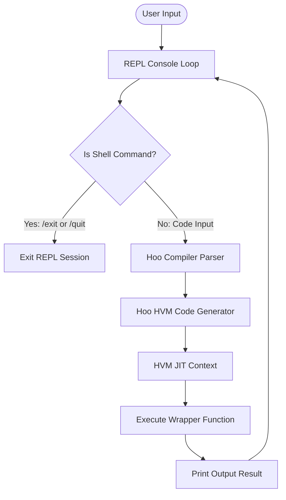

# ISSUE-038: Interactive REPL Integration Plan

## 1. Overview & Objectives

We propose integrating a Read-Eval-Print Loop (REPL) into the Hoo driver executable. When launched with the `--repl` flag, the compiler will enter an interactive shell where developers can write, compile, and execute Hoo code blocks sequentially.

### Key Requirements
1. **Interactive Shell**: Provide a prompt (`>>> `) that reads user input.
2. **Incremental Execution**: Evaluate user code inputs sequentially. The entire session runs within a single JIT compilation context, allowing state (variables, functions, types) to persist.
3. **Exit Commands**: Support `/quit` and `/exit` to terminate the REPL session gracefully.
4. **Modularity**: Implement the REPL shell logic in a dedicated static library target (`hoorepl`) linked with the `hoo` command-line driver.
5. **Robust Test Coverage**: Add unit tests verifying incremental JIT execution, shell command handling, and error recovery.

---

## 2. Architecture & Design



### 2.1 The Incremental JIT Execution Model

Because HVM JIT is designed to compile complete modules, executing standalone statements in a REPL requires wrapping inputs dynamically:
1. **The Session Module**: All user declarations (like classes or functions) are appended to a persistent, virtual session source module.
2. **Statement Wrapper**: Any raw statements or expressions (e.g. `var x = 42;`) are wrapped inside a transient function (e.g. `__repl_line_N()`) that is compiled into the active module context.
3. **Global Scope State Persistence**: 
   - Global variables declared during the REPL session will be stored in a session-managed memory dictionary.
   - The wrapper function `__repl_line_N()` reads and writes variables to this shared memory region so that changes persist between line evaluations.

### 2.2 Compilation and Execution Core
The `hoorepl` library does not re-implement the compiler frontend or the execution engine. Instead, it delegates:
- **Compilation**: Passes user code inputs and wrapper functions to the compiler frontend, which internally uses the AST traversal and translation rules in [HVMCodeGenerator.cpp](file:///Users/benoybose/Projects/hoo/src/codegen/HVMCodeGenerator.cpp) to generate HVM bytecode modules.
- **Execution**: Loads the generated bytecode module into a persistent instance of the execution engine managed by [HVMJIT.cpp](file:///Users/benoybose/Projects/hoo/src/hvm/HVMJIT.cpp), links the external C-ABI runtime symbols, runs the compiled wrapper functions, and extracts execution outcomes or errors.

---

## 3. Implementation Phases

We will implement the REPL integration across five distinct phases:

### Phase 1: REPL Static Library Target (`hoorepl`)
- Create the target files:
  - `src/repl/REPLSession.h` — Declares the `REPLSession` API.
  - `src/repl/REPLSession.cpp` — Handles compilation, wrapper generation, and interactive execution.
- Update `CMakeLists.txt` to define the `hoorepl` static library:
  ```cmake
  add_library(hoorepl STATIC
      src/repl/REPLSession.cpp
      src/repl/REPLSession.h
  )
  target_link_libraries(hoorepl PRIVATE hoo-core)
  ```

### Phase 2: CLI Integration in the Driver
- Update the main `hoo` executable driver (`src/main.cpp` or equivalent):
  - Add command-line parsing logic to check for the `--repl` flag.
  - Link the `hoo` executable target with `hoorepl`:
    ```cmake
    target_link_libraries(hoo PRIVATE hoorepl)
    ```
  - When `--repl` is active, instantiate `REPLSession` and trigger `session.run()`.

### Phase 3: Shell Console Loop & Built-in Command Parser
- Implement the interactive console loop:
  - Prompt user with `>>> ` (or `... ` for multi-line inputs if a block is unclosed).
  - Parse shell commands starting with `/`:
    - `/quit` or `/exit` — Gracefully terminates the loop.
    - `/help` — Lists available commands.
    - `/reset` — Clears compilation history and variables.
  - Gracefully catch compilation errors and runtime exceptions without terminating the REPL loop.

### Phase 4: Incremental Code Generation & Execution
- Manage the compilation state:
  - Keep a growing `std::string` of accumulated global definitions (functions, classes).
  - Wrap expressions inside an execution wrapper (`__repl_line_N`).
  - Call `HVMJIT::loadSourceCode` to compile the session module.
  - Execute the wrapper symbol and print the return value.

### Phase 5: Test Infrastructure
- Create a test file `tests/repl/HooReplTest.cpp` linked against the `hoorepl` library.
- Add test cases covering:
  - Shell command processing.
  - State persistence of variable values across evaluations.
  - Graceful rejection of invalid code with proper error compilation messages.
